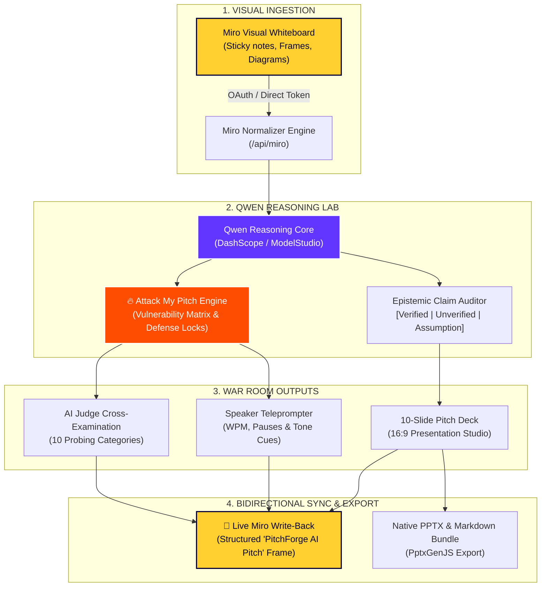

<p align="center">
  <a href="https://miro.com" target="_blank">
    
  </a>
  &nbsp;&nbsp;&nbsp;&nbsp;&nbsp;&nbsp;&nbsp;&nbsp;&nbsp;&nbsp;&nbsp;&nbsp;
  <a href="https://github.com/QwenLM" target="_blank">
    
  </a>
</p>

<h1 align="center">PitchForge — AI Pitch Studio</h1>

<p align="center">
  <strong>Transform raw Miro collaborative boards into defense-hardened, investor-ready pitches that survive the room.</strong>
</p>

<p align="center">
  <a href="#-how-miro-works-in-pitchforge"></a>
  <a href="#-how-qwen-ai-works-in-pitchforge"></a>
  <a href="#-tech-stack"></a>
  <a href="#-tech-stack"></a>
  <a href="#-tech-stack"></a>
</p>

---

## 🌟 The Product Vision: The "AI Pitch War Room"

Most hackathon projects and startup pitches fail not from bad technology, but from **weak narratives, unverified empirical claims, and zero preparation for harsh judge cross-examinations**.

**PitchForge** is an AI pitch war room that bridges two superpowers:
1. **Miro**: Where teams visually brainstorm, map user journeys, place sticky notes, and sketch architecture.
2. **Qwen**: Alibaba Cloud's cutting-edge large language model with deep multi-step reasoning, epistemic claim auditing, and adversarial critique.

PitchForge turns chaotic visual canvas thinking into a battle-tested pitch package, complete with calibrated **Pitch Readiness scores**, VC-grade **"Attack My Pitch"** defenses, a **10-slide 16:9 presentation deck**, a slide-by-slide **teleprompter speaker script**, **synchronized audio voiceovers**, and **live bidirectional Miro canvas write-back**.

---

## 🔄 Complete End-to-End Workflow



---

## 🎨 How Miro Works in PitchForge

Miro is not merely an external export target—it is the **visual operating system** of PitchForge.

### 1. Visual Brainstorm Ingestion
* **What it does**: PitchForge connects directly to the user's Miro account via **Miro REST API v2**.
* **Canvas Scanning**: Ingests sticky notes, shapes, text blocks, frames, and semantic connectors across the board.
* **Author & Tag Resolution**: Captures author attributions and visual clustering to understand how the team structured their ideas.
* **Smart Demo Fallback**: When users don't have active Miro credentials, PitchForge automatically loads a full-fidelity 4-frame Miro canvas simulation with realistic sticky note clusters.

### 2. Spatial-to-Semantic Normalization
* **The Problem**: Miro boards are unstructured, spatial, and nonlinear.
* **The Solution**: PitchForge's normalizer transforms geometric coordinates `(x, y)` and sticky colors into an 8-dimensional semantic context:
  - Problem statements & pain points
  - Target audience & user personas
  - Proposed technical solution
  - Core differentiators & competitive assumptions
  - Technical architecture dependencies

### 3. Live Bidirectional Miro Write-Back
When Qwen finishes generating and hardening the pitch, clicking **[ ✦ Send to Miro ]** writes the entire hardened pitch workspace back onto the user's active Miro board:

```
┌────────────────────────────────────────────────────────────────────────┐
│  🚀 PitchForge AI Pitch (Frame: 3800 × 3600 px)                        │
│                                                                        │
│  [ Executive Pitch Overview Card ]                                     │
│  • Problem Breakdown (Red Stickies)     • Proposed Solution (Cyan)     │
│  • Target Persona (Yellow Stickies)     • Value Proposition (Orange)   │
│                                                                        │
│  [ Technical Architecture Pipeline Flow ]                              │
│  [ Ingest ] ──▶ [ Normalizer ] ──▶ [ Qwen LLM ] ──▶ [ Canvas Write ]   │
│                                                                        │
│  [ 🔥 Attack My Pitch — Vulnerabilities & Skeptic Hardening ]          │
│  • Vulnerability 1 (High Severity)      • Mitigation Strategy          │
│  • Vulnerability 2 (Evidence Gap)       • Grounded Defense Proof       │
│                                                                        │
│  [ 🎯 AI Judge Defense Preparation ]                                   │
│  • Skeptical Questions (Pink/Blue)      • Suggested Answers            │
│                                                                        │
│  [ 🎤 10-Slide Pitch Storyboard & Teleprompter Scripts ]               │
│  • Slide 1: Hook & Pain                 • Slide 2: The Wedge           │
│  • Slide 3: The Architecture            • ... Through Slide 10: Ask    │
└────────────────────────────────────────────────────────────────────────┘
```

* **Version Management**: If a pitch frame already exists on the board, PitchForge automatically prompts the user to either update the existing frame or create an incremented version (`v2`, `v3`) with calculated coordinate offsets to avoid collisions.
* **Resilient Sync**: Supports direct Miro OAuth 2.0 or 1-click **Direct Miro Access Tokens**.

---

## 🧠 How Qwen AI Works in PitchForge

PitchForge is powered by Alibaba Cloud's **Qwen** large language model (e.g. `qwen-max`, `qwen-plus`, `qwen-turbo`), acting as an adversarial pitch strategist rather than a generic text autocomplete.

### 1. Epistemic Claim Auditing
Qwen parses every statement extracted from the Miro whiteboard and classifies it with strict epistemic rigor:
- `[Verified evidence]`: Backed by metrics, pilot data, or benchmarks.
- `[Unverified claim]`: High-sounding claim without empirical proof.
- `[Assumption]`: Underlying hypothesis that could invalidate the thesis.
- `[Evidence needed]`: Critical data points judges will demand.

### 2. Pitch Readiness Scoring (0–100)
A multi-vector calibration across 8 strategic dimensions:
1. **Problem Clarity** (Weight: 15%)
2. **Solution Clarity** (Weight: 15%)
3. **Target User Precision** (Weight: 10%)
4. **Differentiation & Moat** (Weight: 15%)
5. **Empirical Evidence** (Weight: 15%)
6. **Technical Feasibility** (Weight: 10%)
7. **Business Potential / TAM** (Weight: 10%)
8. **Narrative Storytelling** (Weight: 10%)

### 3. 🔥 "Attack My Pitch" (Signature Feature)
Simulates a hyper-skeptical Tier-1 venture capitalist or hackathon judge actively trying to poke holes in the idea:
- Identifies critical structural flaws, defensibility gaps, and platform risks.
- Calculates an initial **Pitch Survival Score**.
- Allows founders to input interactive spoken defenses to harden each vulnerability and dynamically boost their survival calibration.

### 4. 10-Slide Canonical Presentation Generator
Generates a complete, narrative-driven 10-slide deck matching top startup accelerator standards:
- `01 PROBLEM` — The acute, bleeding-neck pain point.
- `02 INSIGHT` — Why existing solutions fail and what changed.
- `03 SOLUTION` — The core mechanism and value proposition.
- `04 PRODUCT` — Live workflow, UI architecture, and feature wedge.
- `05 MARKET` — TAM / SAM / SOM and bottom-up customer wedge.
- `06 BUSINESS MODEL` — Pricing levers, unit economics, and distribution.
- `07 COMPETITION` — 2x2 matrix and unique technical moat.
- `08 TECHNOLOGY` — System architecture, pipeline, and scalability.
- `09 TRACTION` — Pilots, velocity metrics, and execution proof.
- `10 ASK` — Funding requirement, hackathon milestone, and roadmap.

---

## ⚡ The AI Pitch War Room Modules

| Module | What It Does |
|---|---|
| **Board Intelligence** | Ingests live Miro canvas elements, sticky notes, and frames into structured JSON. |
| **Analysis Dashboard** | Displays 3-column workspace with live radial readiness gauge (`86/100`), AI Strategist insights, and evidence audits. |
| **🔥 Attack War Room** | Unpacks critical weaknesses, platform threats, and provides defense locks to raise survival scores. |
| **Presentation Stage** | 16:9 cinematic presentation card viewer with speaker script snippets and instant **PPTX download**. |
| **Speaker Teleprompter** | Slide-by-slide delivery scripts with pace (WPM), tone indicators, and dramatic pause timestamps. |
| **Audio Pitch (TTS)** | Synchronized speech synthesis with live slide tracking, scrubber controls, and speed adjustments. |
| **AI Judge Defense** | Cross-examination questions across 10 evaluation vectors with grounded answers. |
| **Send to Miro Modal** | 1-click write-back dialog with board selector, content checklist, and live canvas integration. |

---

## 🛠 Tech Stack

- **Frontend & App Shell**: Next.js 14 (App Router), React 18, TypeScript 5
- **Styling & Visual Design**: Tailwind CSS with custom **Dark Creative Agency / Digital Studio** aesthetics (`#080808` near-black background, subtle technical grid, tactical `#FF4D00` flame orange lighting)
- **Visual Collaboration**: Miro Developer Platform REST API v2
- **AI Reasoning**: Qwen-Max via DashScope / ModelStudio API
- **Deck Export**: PptxGenJS (16:9 widescreen PPTX generation with speaker notes and custom themes)
- **Audio Voiceover**: HTML5 Web Speech Synthesis API
- **Icons**: Lucide React

---

## 🚀 Getting Started

### 1. Clone the Repository
```bash
git clone https://github.com/Dinesh-design786/miro_qwen.git
cd miro_qwen
```

### 2. Install Dependencies
```bash
npm install
```

### 3. Configure Environment Variables
Create a `.env.local` file in the project root:

```bash
# Miro Workspace Integration
MIRO_CLIENT_ID=your_miro_client_id
MIRO_CLIENT_SECRET=your_miro_client_secret
MIRO_REDIRECT_URL=http://localhost:3000/api/miro/oauth/callback
MIRO_ACCESS_TOKEN=your_optional_direct_access_token

# Qwen AI Reasoning Provider
QWEN_MODEL=qwen-max
QWEN_BASE_URL=https://dashscope.aliyuncs.com/compatible-mode/v1
QWEN_API_KEY=your_qwen_api_key

# Audio Narration Provider
TTS_PROVIDER=web-speech
```

> **Note on Miro Authentication**: You can either configure OAuth credentials via the [Miro Developer Portal](https://developers.miro.com), or simply paste a direct **Miro Access Token** inside the PitchForge write-back dialog under **`[ ⚙️ ACCESS TOKEN ]`**.

### 4. Run the Development Server
```bash
npm run dev
```

Open [http://localhost:3000](http://localhost:3000) in your browser.

---

## 📂 Project Structure

```text
├── app/
│   ├── api/
│   │   ├── analyze/            # Qwen pitch reasoning & evidence auditing
│   │   ├── attack/             # "Attack My Pitch" critique engine
│   │   ├── generate-pitch/     # 10-slide deck & Executive Summary generation
│   │   ├── judge/              # Skeptical AI Judge cross-examination
│   │   └── miro/               # Miro board extraction, token, status & write-back
│   │       ├── boards/         # Active Miro board retrieval
│   │       ├── export-pitch/   # Real Miro canvas frame & element writer
│   │       ├── oauth/          # Miro OAuth authorization & callback
│   │       ├── status/         # Live Miro connection health check
│   │       └── token/          # Secure direct Miro Access Token manager
│   ├── globals.css             # Dark creative agency design tokens & subtle grid
│   ├── layout.tsx              # Root HTML shell & viewport metadata
│   └── page.tsx                # Master interactive studio state machine
├── components/
│   ├── AnalysisDashboard.tsx   # 3-column AI pitch war room & radial gauge
│   ├── AttackMyPitchView.tsx   # VC critique matrix & survival score locks
│   ├── Header.tsx              # Minimal studio nav, Miro status & write-back CTA
│   ├── LandingHero.tsx         # Oversized typography "TURN IDEAS INTO PITCHES."
│   ├── MiroExportModal.tsx     # Write-back modal with direct token panel & checklist
│   ├── PresentationViewer.tsx  # 16:9 presentation stage & 10 pitch cards
│   ├── ProjectCreationModal.tsx# Idea intake modal & sample presets
│   └── PipelineProgress.tsx    # Step indicator (Board → Analyze → Attack → Pitch)
├── services/
│   ├── ai/
│   │   ├── qwenClient.ts       # Qwen API client (OpenAI-compatible)
│   │   ├── pitchAnalyzer.ts    # Zod-validated pitch analysis engine
│   │   ├── pitchCritic.ts      # Adversarial VC critique generator
│   │   ├── pitchGenerator.ts   # 10-slide deck & executive summary generator
│   │   └── judgeAgent.ts       # Skeptical judge Q&A generator
│   ├── miro/
│   │   ├── miroClient.ts       # Miro REST API v2 client
│   │   ├── pitchWriter.ts      # Native Miro frame, sticky note & shape builder
│   │   ├── boardParser.ts      # Canvas item normalizer
│   │   └── tokenStore.ts       # Secure local token persistence
│   └── export/
│       └── pptxExport.ts       # Native 16:9 PPTX & Markdown exporter
```

---

## 🛡 Security & Privacy

- **Protected Credentials**: Miro access tokens, client secrets, and Qwen API keys are never exposed to client-side bundles.
- **Git Protection**: `.env`, `.env.local`, and `data/miro_token.json` are strictly ignored by `.gitignore`.
- **Sensitive Token Masking**: API diagnostic logs sanitize sensitive secrets and tokens before logging.

---

## 📜 License

Distributed under the **MIT License**. Built for builders, hackathon competitors, and startup teams worldwide.